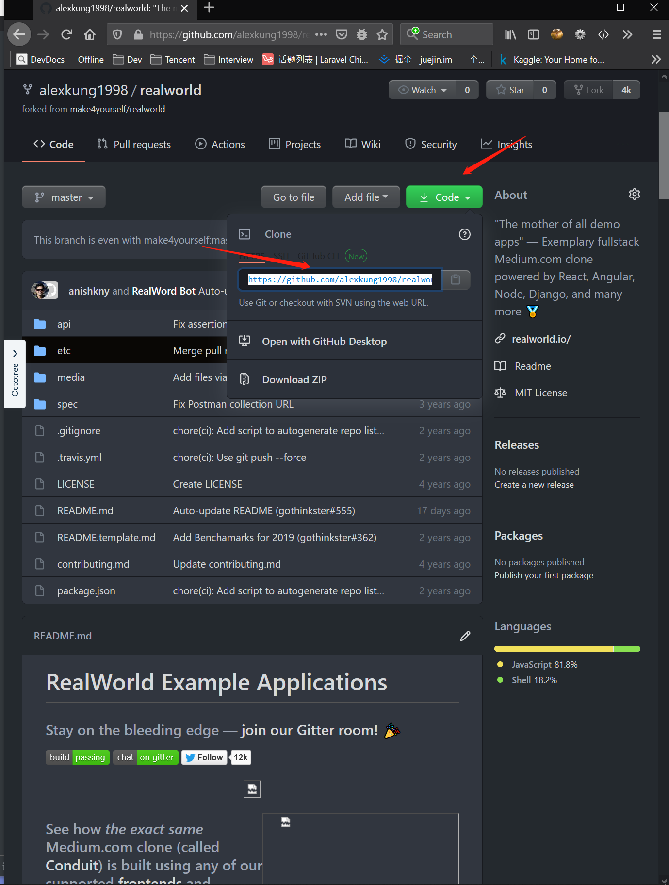

## 什么是 Git

Git（读音为/gɪt/）是一个开源的分布式版本控制系统，可以有效、高速地处理从很小到非常大的项目版本管理。 

Git 是 [Linus Torvalds](https://baike.baidu.com/item/Linus Torvalds/9336769) 为了帮助管理 Linux 内核开发而开发的一个开放源码的版本控制软件。

简单来说就是控制项目文件版本，可以很方便的回滚，让多人协作最后合并代码的一个管理工具。

## 安装 Git

[git 安装地址](https://git-scm.com/downloads) 选择适合你的操作系统的安装，此处略去安装细节。

通过命令行检查 git 是否安装成功。

``` shell
$ git --version
```


记得[配置 git 信息](https://www.yiibai.com/git/git_config.html)

``` shell
$ git config --global user.name "username"
$ git config --global user.email "email.com@gmail.com"
```


## 注册 GitHub

进入 [GitHub](https://github.com/)  注册用户，注册成功后找到我们组织下的仓库 fork 一份到自己的仓库下。

## Fork 项目

例如 [realworld](https://github.com/make4yourself/realworld) 首仓

- Watch 可以收到该主仓库下所有动态，比如一些发版信息，还有 issue 信息，因此建议大家都 Watching
- Star  好比收藏作用，可以从自己的收藏夹（Star）很方便地找到该仓库
- Fork  就是复制一份这个仓库到自己名下

然后点击 Fork ，页面跳转等待一会儿后会跳转到自己 Fork 的仓库下，这时候就能看见仓库名前是自己的用户名，然后子标题里能看见 forked from make4yourself/realworld


## 通过 git 将线上项目拉到线下

在刚刚 fork 下来的页面上有个 Code 按钮点击，会有一个 HTTPS 地址，我们能通过这个地址把项目拉到本地。



复制地址，在命令行中执行下面的命令把项目克隆到本地。

``` shell
$ git clone https://github.com/alexkung1998/realworld.git
```

注意：后面请接上你仓库下刚刚复制的地址

然后在目录下就会出现克隆下来的这个文件夹，进入文件夹。你就能对该项目中的文件进行编辑了。


## 修改文件后提交代码

现在，你得明白你对文件的所有操作都只仅仅在本机上，相当于你维护着云端的仓库和本机上的两个仓库，但是你能通过一定的操作，把本地仓库的操作同步到云端，同理，你也能把云端的变动同步到本地。而<u>本地的所有 git 操作都是基于本地仓进行的。</u>

大致操作如下

- 修改文件
- add
- commit
- push
- pull request

以下是我的演示

### **修改文件**


```shell
// 注：在 README.md 文件末尾追加 “我的修改” 内容
$ echo "我的修改" >> README.md 
```

通过 status 可以看见哪些文件做了修改

### **add 和 commit 文件**


### **push 本地仓给云端仓** 


然后看云端的 README 会发现本地修改以及提交到了云端。

### **Pull Request**

当完成了翻译想把自己的修改，提交到 make4yourself 组织的仓库中，就在自己的 GitHub 的仓库主页会有 Pull request 选项。根据步骤一步一步下去就可以提交对主仓库的修改。


以上就是简单的一整套 git 合作流程了。

修改内容 -> 提交修改 -> 同步到云端 -> 请求合并到主仓

# 拓展阅读

[必须要会的Git基本使用及常用命令操作](http://www.jianshu.com/p/555e7a188312) 

[全面理解Git](https://zhuanlan.zhihu.com/p/24081900)

[进阶 git flow 工作流程](https://juejin.im/post/6844903917399048199) （其实也就是对版本进行了更合理的整理）